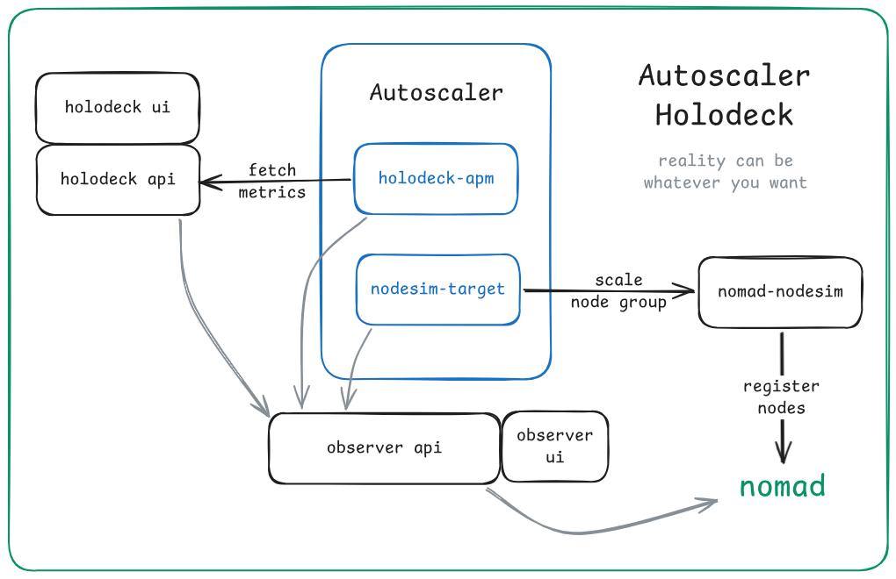

# Nomad Autoscaler Holodeck

Control a false reality to play with core
[nomad-autoscaler](https://github.com/hashicorp/nomad-autoscaler)
functionality.



## Demo

### Run

Build the docker container:

```
make docker
```

Run Nomad:

```
make nomad
```

In another shell run the job and required setup:

```
make job
```

### Interact

#### Nomad CLI / web UI

```shell
eval $(make env) # NOMAD_ADDR and NOMAD_TOKEN
nomad ui -authenticate
```

#### Holodeck and Observer web UIs

Custom UIs for setting metrics and observing events.

The `ui` make target should output URLs for the observer and holodeck, e.g.:

```
$ make ui
observer: nomad service info observer
 * http://10.156.19.120:9090

holodeck: nomad service info holodeck
 * http://10.156.19.120:9091
```

#### Logs

Convenience targets tail nomad logs for different services:

```
make logs-observer
make logs-holodeck
make logs-nodesim
make logs-autoscaler
```

#### Set a metric

In the autoscaler logs, you should see an error like:

> failed to query source: rpc error: code = Unknown desc = holodeck: metric not found: cpu_utilization (status 404)

You'll need to create that metric for the autoscaler apm plugin to discover.

In the Holodeck UI, create an Authored Metric called `cpu_utilization` with value `0.7`.

`0.7` is the target value as configured in the autoscaler policy
([demo/autoscaler/policies/node-group.hcl](demo/autoscaler/policies/node-group.hcl)),
so the autoscaler should interpret this as being the correct value.

Try these values to see different scaling behavior:

- `1`: above target, should trigger scale up
- `0.7`: at target, should not trigger scaling
- `0.5`: below target, should trigger scale down
- `0`: well below target, should scale down to zero

### Stop

When you're done, stop the demo job:

```
make stop
```

You can delete the demo job policy with

```
make clean
```

And stop the Nomad agent with ctrl+C.
